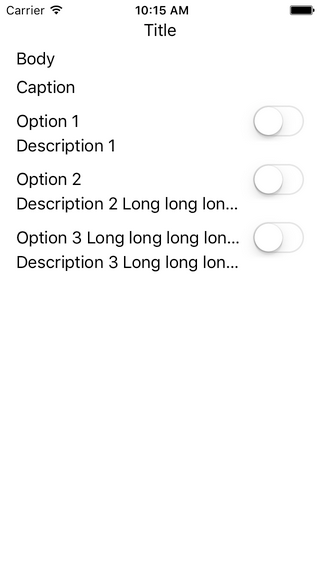
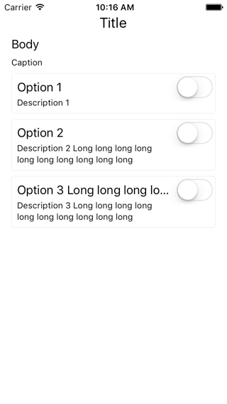

[](https://swift.org/)
[](https://github.com/Carthage/Carthage)
[](https://cocoapods.org/)

# StyleSheet

An approach to define reusable and composable UI styles.

Having some base styles defined you can use them like so:

```swift
final class TitleLabel: UILabel, TitleFontStyle {}
final class BodyLabel: UILabel, BodyFontStyle, MultilineLabelStyle {}
final class CaptionLabel: UILabel, CaptionFontStyle, MultilineLabelStyle {}
```

 

For a complete usage example see the [Example](https://github.com/werediver/StyleSheet/tree/master/Example) project.

For the implementation details see [`Style.swift`](https://github.com/werediver/StyleSheet/blob/master/Sources/Style.swift) and [`RootStyle.swift`](https://github.com/werediver/StyleSheet/blob/master/Sources/RootStyle.swift).

## Motivation

### Why to define the UI style in code?

Defining the UI style in code is good because:

- It gives _reproducible_ results.
- It gives _reusable_ results.
- It gives _composable_ results.

### Why not to use `UIAppearance`?

Because we can do better. By avoiding the use of the appearance-proxy we can access _all_ properties and methods (not only `UI_APPEARANCE_SELECTOR` and `dynamic`), and nested objects!

## Installation

### Carthage

```
github "werediver/StyleSheet" ~> 2.1
```

### CacoaPods

```ruby
pod 'StyleSheet', :git => 'https://github.com/werediver/StyleSheet.git', :tag => 'v2.1.0'
```

Note: check the latest available version!

## License

[MIT](https://github.com/werediver/StyleSheet/blob/master/LICENSE)
